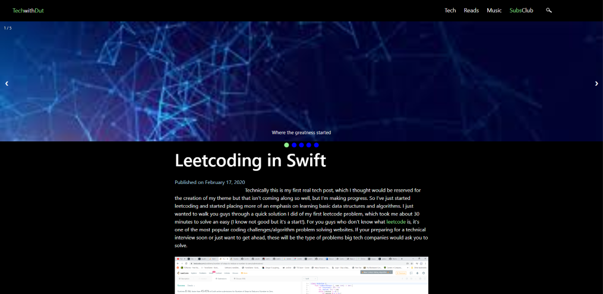
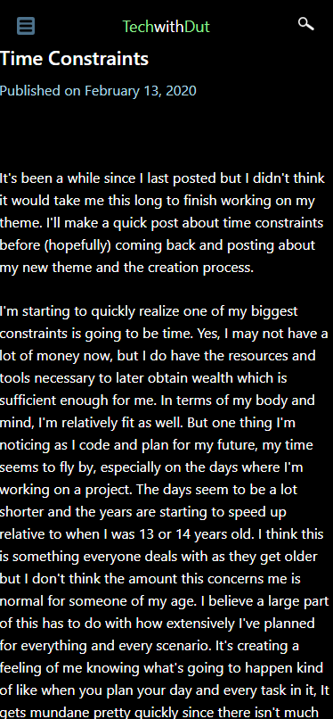
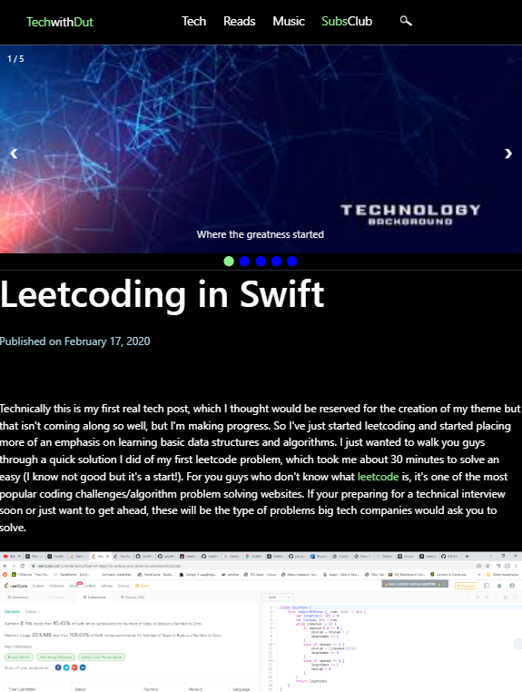
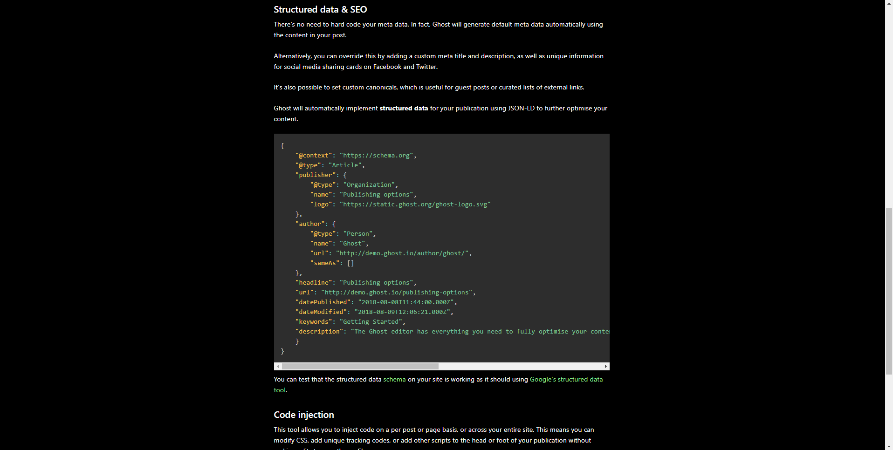

# Diaspora
Diaspora is a custom minimalist, dark theme for ghost. You can see a working production on my tech blog https://www.TechwithDut.com/
It might take a while to load if you are following the link, if so you might have better luck with doing a google search and trying from there if you want to read my content.

##Preview

##Download
The zip file neccesary to download the theme can be found [here](https://github.com/thejokester1/diaspora/blob/master/dist/diaspora.zip) and downloading the raw file and upload it to your ghost website.

##Features
* Clean and beautiful design 💅🏼
* Lightning fast ⚡️
* Fully responsive, looks great on any device 📱
* Compatible with modern browsers 💻
* Fast support 📞
* Minimialist Dark theme
* Page by page post format
* Posts seperated by categories

##Theme Development
This theme is far from done and there are a few errors like how images kind of break when viewed are mobile. There is a section called SubsClub that isn't functional at the moment but I plan on releasing an update for it soon. It seems like the first paragraph of the article is also not indenting correctly and simarly code blocks and youtube videos don't exactly align correctly to the paragraphs. Gallery images are also broken and are very elongated so best not to use those until I can fix them. I haven't added card support but this is also on my feature list along with a comment section. These are all the bugs I'm aware of at the moment but It could be more that I've looked over. If you have any suggestions or just want to help me out your certainly welcome to push a commit for me to look over.

##Final Notes
I'll add more comments and refactor the code base to make it easier to read and understand. Thankfully this isn't a really big project so It shouldn't be too diffcult to understand if you worked with ghost themes before

##Changes
###Diaspora v1.1
Fixed Code blocks and added syntax highlighting support for a cleaner look with Prism.js
